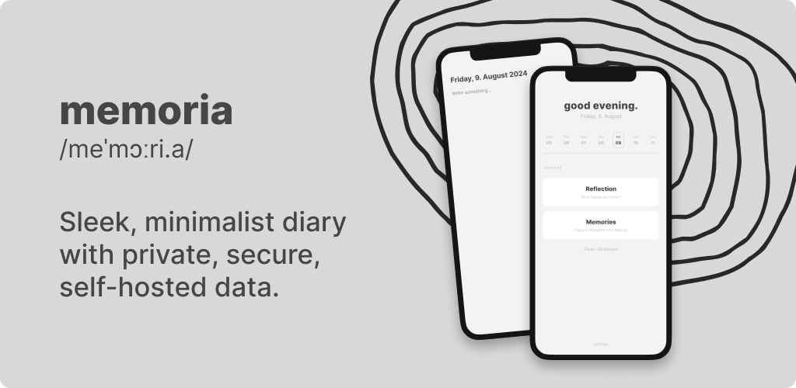
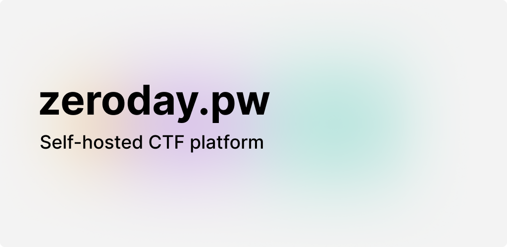
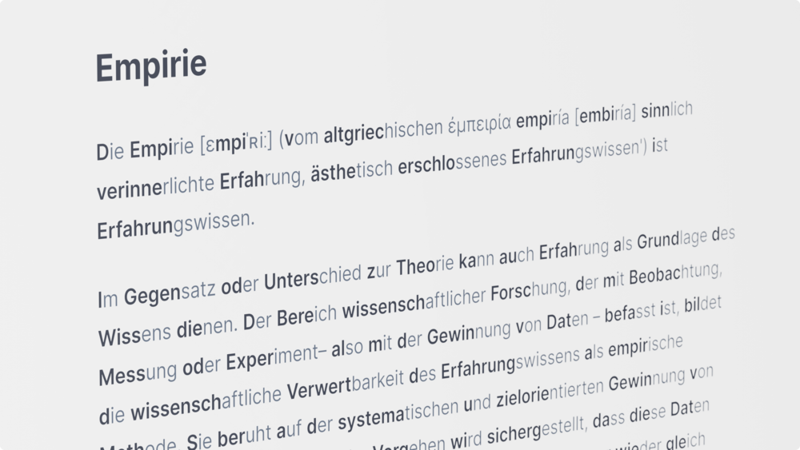
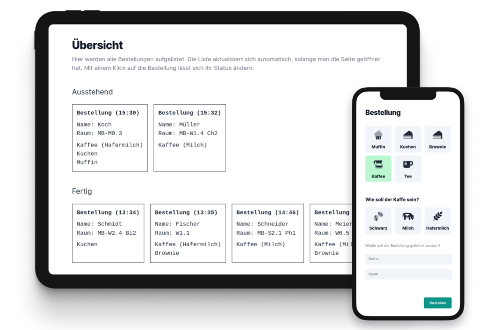
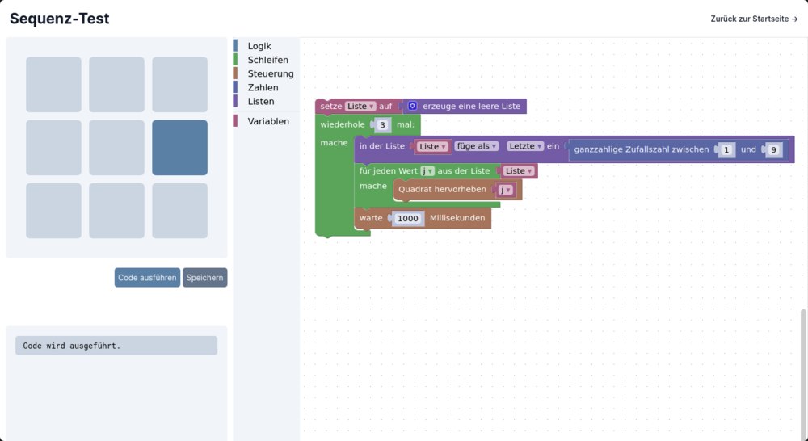

<pre align="center">
<strong>Paul Hoerenz /</strong> <a href="https://paul.hoerenz.com">Homepage</a> / <a href="https://github.com/xp4u1">GitHub</a> / <a href="https://apps.apple.com/us/developer/paul-hoerenz/id1566607321">App Store</a> / <a href="https://play.google.com/store/apps/developer?id=Paul+Hoerenz&hl=en-US">Google Play</a></pre>

</img>

I'm a Cyber Security student and work at ZEISS, keeping digital systems safe. In my free time, I enjoy developing websites and apps. I also mentor at juFORUM, leading workshops for youth groups to share my passion for tech.

If you use my open source projects, consider **[supporting my work](https://github.com/sponsors/xp4u1)**. Thank you!</b> 

  

### My Commitment to (Tech) Education

I had to teach myself all my IT skills because I didn't have anyone to support me. Unfortunately, this is the case at many schools in Germany (and the world). I want to help young people who are interested in technology. That's why I'm juFORUM mentor.

I want **education to be free**. That's why I've published open source projects like [Discite](https://github.com/xp4u1/discite) that are free in Google Play and the Apple App Store.

My work as a mentor is voluntary and I have to cover the costs for the Apple Developer costs for Discite (€99 per year) myself. Therefore, I am happy about any support, such as GitHub Sponsors or through a purchase of one of my other apps on Google Play or in the App Store like [memoria](https://github.com/xp4u1/memoria).

 

### Workshops

As part of my role as a juFORUM mentor, I've led workshops focused on technology and software development. If you’d like me to conduct a workshop at your location, please find more information [here](https://www.juforum.de/mentoren/workshopangebot).

All of my workshop materials are open source, making them freely accessible for anyone to use and adapt.

- **Basics of app development**: [xp4u1/workshop](https://github.com/xp4u1/workshop) (German)

 

**2024**:

- **Fraunhofer Talent Take Off – Vernetzen**: Basics of app development

**2023**:

- **Fraunhofer Talent Take Off – Vernetzen**: Basics of app development
- **juFORUM Mentorenwochenende**: Basics of app development

 

### Featured Projects

- **[memoria](https://github.com/xp4u1/memoria)** Sleek, minimalist diary with private, secure, self-hosted data.
- **[Discite](https://github.com/xp4u1/discite)** The smart app for learning Latin (German)
- **[zeroday.pw](https://github.com/xp4u1/zeroday_pw)** Self-hosted CTF platform with automated subdomains, isolated challenges, and full data control.
- **[Reading Study](https://github.com/xp4u1/reading_study)** Empirical study on Bionic Reading® (German)

  

