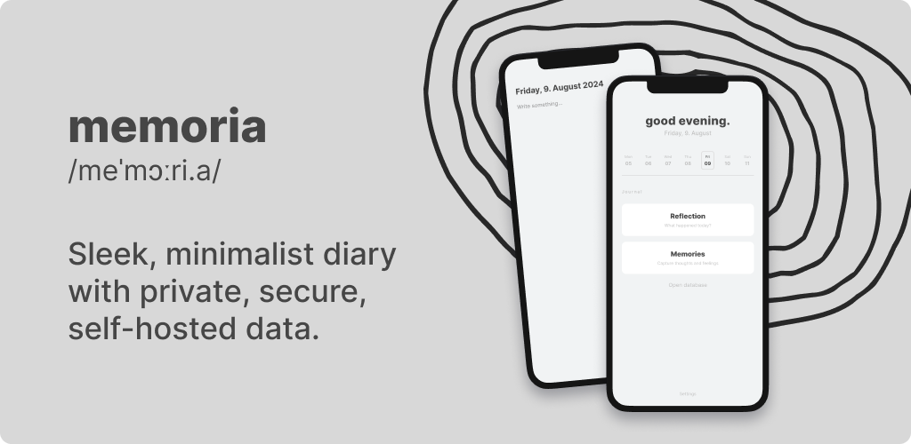
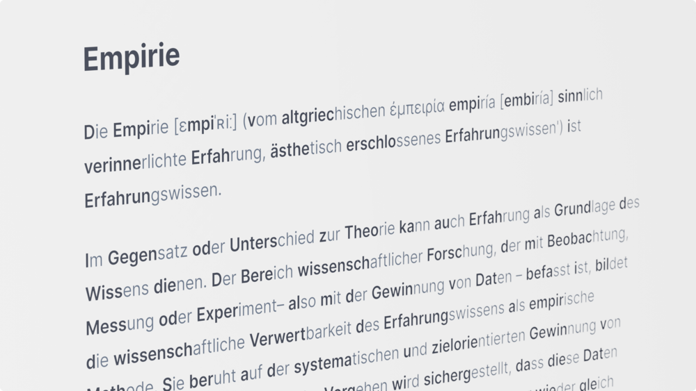
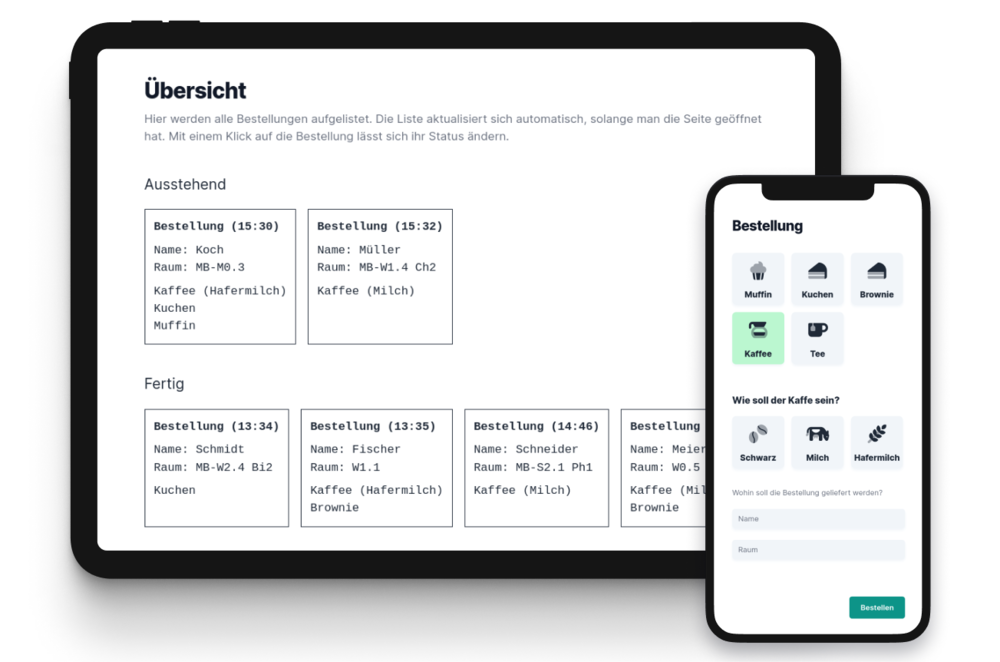
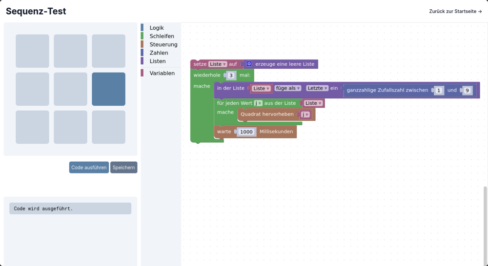

<pre align="center">
<strong>Paul Hoerenz /</strong> <a href="https://paul.hoerenz.com">Homepage</a> / <a href="https://github.com/xp4u1">GitHub</a> / <a href="https://apps.apple.com/us/developer/paul-hoerenz/id1566607321">App Store</a> / <a href="https://play.google.com/store/apps/developer?id=Paul+Hoerenz&hl=en-US">Google Play</a></pre>

</img>

I'm a Cyber Security student working at ZEISS, where I help keep digital systems secure.

Outside of work, I enjoy building websites, apps, and open source projects. I also volunteer as a mentor at juFORUM, where I organize and lead workshops to introduce young people to software development and cyber security.

### Workshops

As a juFORUM mentor, I regularly lead hands-on workshops on software development and cyber security. All workshop materials are open source and freely available.

- **Basics of app development**: [xp4u1/app_workshop](https://github.com/xp4u1/app_workshop) (German)
- **Hack me if you can - Introduction to Cyber Security**: [xp4u1/cybersecurity_workshop](https://github.com/xp4u1/cybersecurity_workshop) (German)

 

**2026**:

- **Zukunftsakademie Heidenheim**: Hack me if you can - Introduction to Cyber Security
- **Zukunftsakademie Heidenheim**: Basics of app development

**2025**:

- **Zukunftsakademie Heidenheim**: Basics of app development
- **Fraunhofer Talent Take Off – Vernetzen**: Hack me if you can - Introduction to Cyber Security

**2024**:

- **Fraunhofer Talent Take Off – Vernetzen**: Basics of app development

**2023**:

- **Fraunhofer Talent Take Off – Vernetzen**: Basics of app development
- **juFORUM Mentorenwochenende**: Basics of app development

 

### Featured Projects

- **[memoria](https://github.com/xp4u1/memoria)** Sleek, minimalist diary with private, secure, self-hosted data.
- **[zeroday.pw](https://github.com/xp4u1/zeroday_pw)** Self-hosted CTF platform with automated subdomains, isolated challenges, and full data control.
- **[App Workshop](https://github.com/xp4u1/app_workshop)** Custom low-code platform with companion app to teach (app/game) development

  

